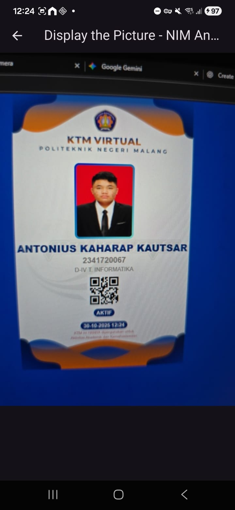
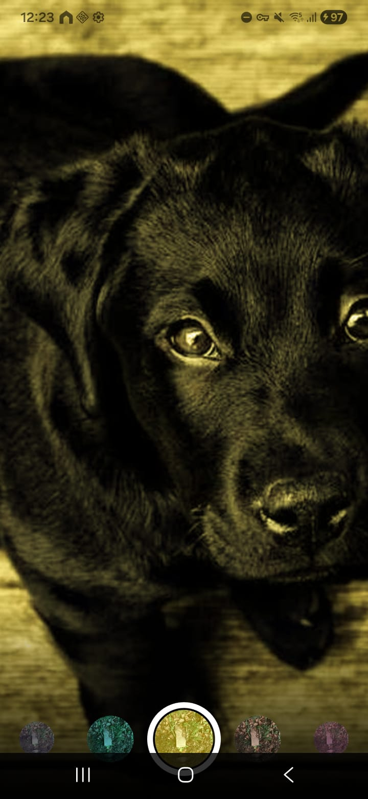
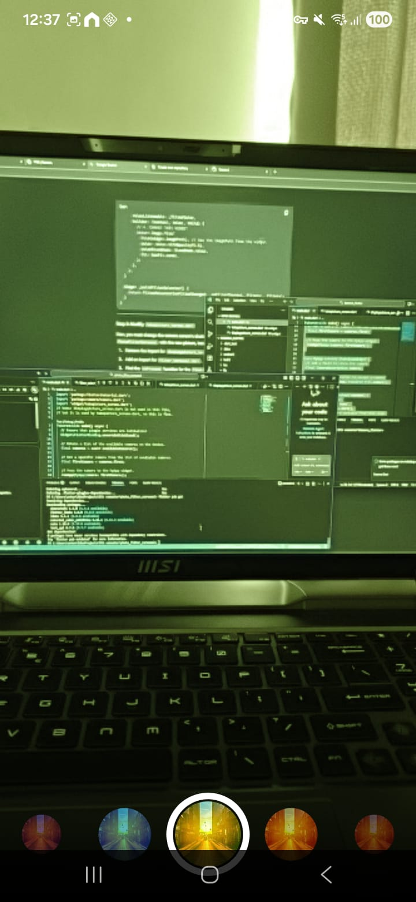

# Practicum Task

1. Selesaikan Praktikum 1 dan 2, lalu dokumentasikan dan push ke repository Anda berupa screenshot setiap hasil pekerjaan beserta penjelasannya di file README.md! Jika terdapat error atau kode yang tidak dapat berjalan, silakan Anda perbaiki sesuai tujuan aplikasi dibuat!
2. Gabungkan hasil praktikum 1 dengan hasil praktikum 2 sehingga setelah melakukan pengambilan foto, dapat dibuat filter carouselnya!
3. Jelaskan maksud void async pada praktikum 1?
4. Jelaskan fungsi dari anotasi @immutable dan @override ?
5. Kumpulkan link commit repository GitHub Anda kepada dosen yang telah disepakati!

# Answer

1. 
1st Practicum end result

2nd Practicum end result

2. Combined both the 1st and 2nd practicum code

End result:

3. The void async keywords indicate that a function is asynchronous and does not return any value. The async keyword permits this function to execute long-running operations, such as accessing the camera or taking a picture, without blocking the application by using the await keyword. The void keyword means that once the function is complete, it does not send any data back.

4. The @immutable annotation is a mark on a class, say FilterItem or FilterSelector, informing the developer that all of its properties are to be final and should not be changed after the object has been created for the first time. On the other hand, the @override annotation is put above a method, say build or initState, indicating that the method is intentionally overriding a method that had already been defined in the parent class it extends.